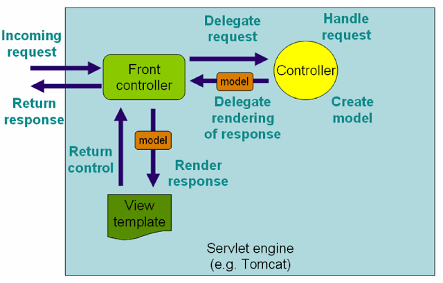
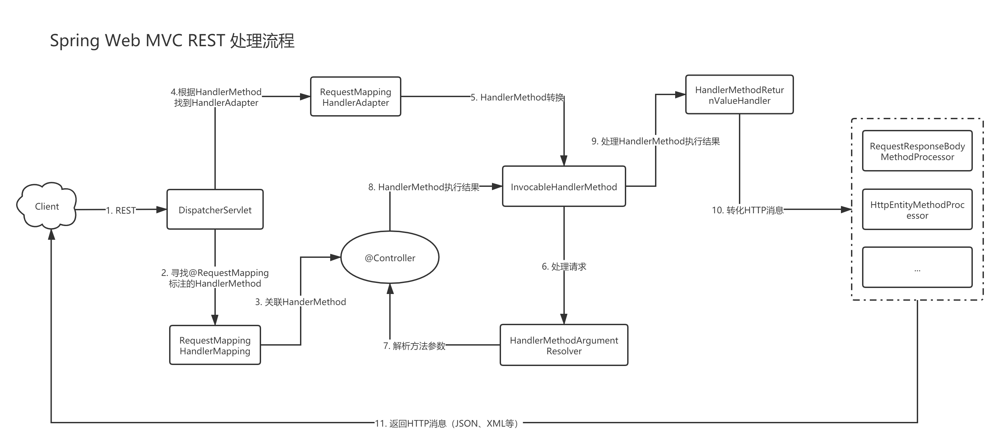
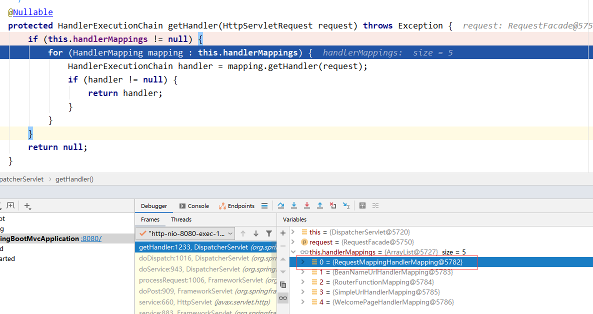
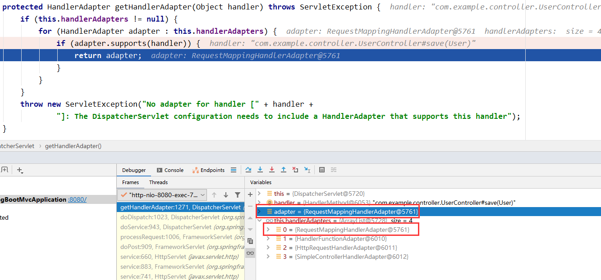
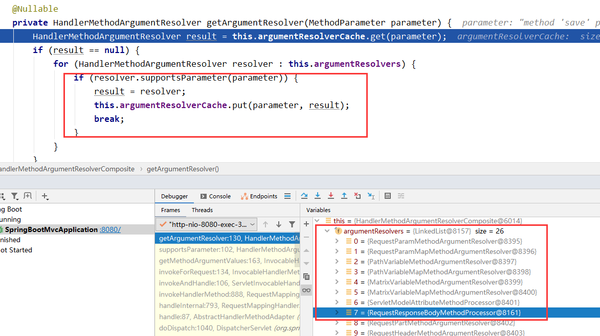

## Spring MVC REST 处理流程

### 一、什么是Spring Web MVC

> 官网介绍：Spring Web MVC is the original web framework built on the Servlet API and has been included in the Spring Framework from the very beginning. The formal name, “Spring Web MVC,” comes from the name of its source module (spring-webmvc), but it is more commonly known as “Spring MVC”.

简单来说就是 Spring Web MVC 是基于 Servlet API 构建的Web框架，我们通常称之为 Spring MVC。

### 二、传统 Spring Web MVC 处理流程



这个简单流程图可以看到 Spring MVC 接收请求、处理请求、渲染视图、返回视图的流程。

### 三、Spring Web MVC REST 处理流程

#### 3.1 Spring Web MVC REST 处理流程图



#### 3.2 环境准备

使用 Springboot 准备一个 RestController 配合 Postman 来追踪 Spring MVC 处理 HTTP请求。

```java
@RestController
@RequestMapping("/user")
public class UserController {
    @PostMapping("/")
    public User save(@RequestBody User user, HttpServletRequest request) {
        user.setId(1000L);
        return user;
    }
}
```

#### 3.3 Spring Web MVC REST 处理流程源码分析

1. ##### 使用 Postman 发起 HTTP POST `localhost:8080/user/` 请求，由前端控制器 `DispatcherServlet#doDispatch` 处理请求。

   `DispatcherServlet#doDispatch` 代码如下，我们不关注异步处理、拦截器 `HandlerInterceptor`处理、异常处理，因此部分源码做删减

   ```java
   protected void doDispatch(HttpServletRequest request, HttpServletResponse response) throws Exception {
       HttpServletRequest processedRequest = request;
       HandlerExecutionChain mappedHandler = null;
       boolean multipartRequestParsed = false;
   
       try {
           ModelAndView mv = null;
           Exception dispatchException = null;
   
           try {
               // 寻找支持当前 request 的 handler，这里返回的 mappedHandler 我们需要关注的是
               // mappedHandler.getHandler() 也就是 HandlerMethod
               // Determine handler for the current request.
               mappedHandler = getHandler(processedRequest);
   			
               // 寻找支持当前 request 的 handler adapter
               // Determine handler adapter for the current request.
               HandlerAdapter ha = getHandlerAdapter(mappedHandler.getHandler());
   			
               // 实际调用 handler 也就是调用 @Controller#@RequestMapping
               // Actually invoke the handler.
               mv = ha.handle(processedRequest, response, mappedHandler.getHandler());
   			
               // 获取视图名称，mv 为 null 时不处理
               applyDefaultViewName(processedRequest, mv);
           } catch(Exception e){
               ...
           }
           // 异常日志打印、视图渲染、执行拦截器栈的 afterCompletion 方法等操作
           processDispatchResult(processedRequest, response, mappedHandler, mv, dispatchException);
       } catch (Exception ex) {
           ...
       } finally {
           ...
       }
   }
   ```

2. ##### 寻找 `HandlerMapping`

   `mappedHandler = getHandler(processedRequest);`跟踪代码到getHandler方法，从下图可以看到有 5 个 handlerMappings 可供选择，`RequestMappingHandlerMapping` 处在第一位，因此会被选择，并返回 HandlerExecutionChain。

   

3. ##### 关联 `HandlerMethod`

   `HandlerExecutionChain#getHandler`会返回当前 request 请求的 `HandlerMethod`，因此`RequestMappingHandlerMapping` 会关联到一个 `HandlerMethod`。

   跟踪代码 

   `DispatcherServlet#getHandler` ==> `mapping.getHandler(request)`

   ==>`RequestMappingHandlerMapping#getHandlerInternal`

   ==>`AbstractHandlerMapping#getHandlerInternal`

```java
protected HandlerMethod getHandlerInternal(HttpServletRequest request) throws Exception {
    // 请求路径，这里我们请求的路径是 /user/
    String lookupPath = getUrlPathHelper().getLookupPathForRequest(request);
    request.setAttribute(LOOKUP_PATH, lookupPath);
    this.mappingRegistry.acquireReadLock();
    try {
        // 找到最佳匹配 HandlerMethod：@RequestMapping#path="/user/" &&				  			// @RequestMapping#method=RequestMethod.POST
        HandlerMethod handlerMethod = lookupHandlerMethod(lookupPath, request);
        return (handlerMethod != null ? handlerMethod.createWithResolvedBean() : null);
    }
    finally {
        this.mappingRegistry.releaseReadLock();
    }
}
```

4. ##### 根据 `HandlerMethod` 寻找 `HandlerAdapter`

```java
protected HandlerAdapter getHandlerAdapter(Object handler) throws ServletException {
   if (this.handlerAdapters != null) {
      for (HandlerAdapter adapter : this.handlerAdapters) {
         if (adapter.supports(handler)) {
            return adapter;
         }
      }
   }
   throw new ServletException("No adapter for handler [" + handler +
         "]: The DispatcherServlet configuration needs to include a HandlerAdapter that supports this handler");
}

public final boolean supports(Object handler) {
	return (handler instanceof HandlerMethod && supportsInternal((HandlerMethod) handler));
}
```



结合代码和 debug 可以看到 `RequestMappingHandlerAdapter` 会被选择

找到 `RequestMappingHandlerAdapter` 后就会由 `RequestMappingHandlerAdapter` 发起对 `HandlerMethod` 的调用

```java
mv = ha.handle(processedRequest, response, mappedHandler.getHandler());
```

后面讨论 `RequestMappingHandlerAdapter`  处理请求流程

5. ##### `RequestMappingHandlerAdapter`  处理请求流程

ha.handler 会调用父类 `AbstractHandlerMethodAdapter#handler` ，再调用子类具体实现的`RequestMappingHandlerAdapter#handleInternal`，继续调用 invokeHandlerMethod 去实际调用 `HandlerMethod` 并返回 `ModelAndView`。我们一步一步分析处理流程

```java
// 源码有删减
protected ModelAndView invokeHandlerMethod(HttpServletRequest request,
			HttpServletResponse response, HandlerMethod handlerMethod) throws Exception {

    ServletWebRequest webRequest = new ServletWebRequest(request, response);
    try {
        WebDataBinderFactory binderFactory = getDataBinderFactory(handlerMethod);
        ModelFactory modelFactory = getModelFactory(handlerMethod, binderFactory);
		// 将 HandlerMethod 转换为可调用的 ServletInvocableHandlerMethod
        ServletInvocableHandlerMethod invocableMethod = createInvocableHandlerMethod(handlerMethod);
        if (this.argumentResolvers != null) {
            // 设置HanclerMethod 入参解析器
            invocableMethod.setHandlerMethodArgumentResolvers(this.argumentResolvers);
        }
        if (this.returnValueHandlers != null) {
 
 			// 设置 HandlerMethod 返回值解析器
            invocableMethod.setHandlerMethodReturnValueHandlers(this.returnValueHandlers);
        }
        // 注册参数绑定工厂，主要内容是 validator 校验和 converter 消息转换器
        invocableMethod.setDataBinderFactory(binderFactory);
        invocableMethod.setParameterNameDiscoverer(this.parameterNameDiscoverer);

        ModelAndViewContainer mavContainer = new ModelAndViewContainer();
        mavContainer.addAllAttributes(RequestContextUtils.getInputFlashMap(request));
        modelFactory.initModel(webRequest, mavContainer, invocableMethod);
        mavContainer.setIgnoreDefaultModelOnRedirect(this.ignoreDefaultModelOnRedirect);
		
        // 通过反射调用 @Controller#RequestMapping
        invocableMethod.invokeAndHandle(webRequest, mavContainer);
        
        return getModelAndView(mavContainer, modelFactory, webRequest);
    }
    finally {
        webRequest.requestCompleted();
    }
}
```

`RequestMappingHandlerAdapter`  处理请求主要有以下流程：

- 将 `HandlerMethod` 转换为可调用的 `ServletInvocableHandlerMethod`
- 方法参数解析与绑定
- 执行@Controller#RequestMapping
- 处理@Controller#RequestMapping执行结果
- 转化为HTTP消息
- 标记请求已经完全处理，不需要再返回视图

##### 5.1 将 `HandlerMethod` 转换为可调用的 `ServletInvocableHandlerMethod`

```java
ServletInvocableHandlerMethod invocableMethod = createInvocableHandlerMethod(handlerMethod);
```

##### 5.2 方法参数解析与绑定

源码位置：

RequestMappingHandlerAdapter#invokeHandlerMethod {invocableMethod.invokeAndHandle(webRequest, mavContainer);}

===> ServletInvocableHandlerMethod#invokeAndHandle {Object returnValue = invokeForRequest(webRequest, mavContainer, providedArgs);}

===> InvocableHandlerMethod#invokeForRequest {Object[] args = getMethodArgumentValues(request, mavContainer, providedArgs);}

```java
protected Object[] getMethodArgumentValues(NativeWebRequest request, @Nullable ModelAndViewContainer mavContainer,
			Object... providedArgs) throws Exception {
	// 获取方法参数列表
    MethodParameter[] parameters = getMethodParameters();
    if (ObjectUtils.isEmpty(parameters)) {
        return EMPTY_ARGS;
    }

    Object[] args = new Object[parameters.length];
    // 遍历绑定参数列表每个参数
    for (int i = 0; i < parameters.length; i++) {
        MethodParameter parameter = parameters[i];
        parameter.initParameterNameDiscovery(this.parameterNameDiscoverer);
        args[i] = findProvidedArgument(parameter, providedArgs);
        if (args[i] != null) {
            continue;
        }
        // 判断是否有支持参数解析的解析器
        if (!this.resolvers.supportsParameter(parameter)) {
            throw new IllegalStateException(formatArgumentError(parameter, "No suitable resolver"));
        }
        try {
            // 参数解析
            args[i] = this.resolvers.resolveArgument(parameter, mavContainer, request, this.dataBinderFactory);
        }
        catch (Exception ex) {
            ...
        }
    }
    return args;
}
```



标记有 @RequestBody 的参数会被 `RequestResponseBodyMethodProcessor` 解析

```java
public boolean supportsParameter(MethodParameter parameter) {
    return parameter.hasParameterAnnotation(RequestBody.class);
}
```

`RequestResponseBodyMethodProcessor` 解析方法

```java
public Object resolveArgument(MethodParameter parameter, @Nullable ModelAndViewContainer mavContainer,
      NativeWebRequest webRequest, @Nullable WebDataBinderFactory binderFactory) throws Exception {

   parameter = parameter.nestedIfOptional();
   // 从 request 输入流读取 json 字符串，通过ContentType选择合适的 HttpMessageConverter 解析为 java 对象
   // ContentType为application/json 会使用 MappingJackson2HttpMessageConverter 进行解析
   Object arg = readWithMessageConverters(webRequest, parameter, parameter.getNestedGenericParameterType());
   String name = Conventions.getVariableNameForParameter(parameter);

    // 参数校验相关
   if (binderFactory != null) {
      WebDataBinder binder = binderFactory.createBinder(webRequest, arg, name);
      if (arg != null) {
         validateIfApplicable(binder, parameter);
         if (binder.getBindingResult().hasErrors() && isBindExceptionRequired(binder, parameter)) {
            throw new MethodArgumentNotValidException(parameter, binder.getBindingResult());
         }
      }
      if (mavContainer != null) {
         mavContainer.addAttribute(BindingResult.MODEL_KEY_PREFIX + name, binder.getBindingResult());
      }
   }

   return adaptArgumentIfNecessary(arg, parameter);
}
```

##### 5.3 执行@Controller#RequestMapping

回到 `InvocableHandlerMethod#invokeForRequest` 解析完入参后会通过反射的方式去调用@Controller#RequestMapping 也就是我们这里的 UserController 的 save 方法

```java
public Object invokeForRequest(NativeWebRequest request, @Nullable ModelAndViewContainer mavContainer,
			Object... providedArgs) throws Exception {
	// 解析参数
    Object[] args = getMethodArgumentValues(request, mavContainer, providedArgs);
    if (logger.isTraceEnabled()) {
        logger.trace("Arguments: " + Arrays.toString(args));
    }
    // 使用解析后的入参调用方法
    return doInvoke(args);
}
```

```java
protected Object doInvoke(Object... args) throws Exception {
    ReflectionUtils.makeAccessible(getBridgedMethod());
    try {
        // 反射调用UserController的save(User)方法
        // getBridgedMethod():Method:UserController.save
        // getBean():UserController
        // args: Object[]: {User:入参user实例}
        return getBridgedMethod().invoke(getBean(), args);
    }
    catch (...) {
        ...
    }
 
}
```

##### 5.4 处理@Controller#RequestMapping执行结果、转化为HTTP消息、标记请求已经完全处理

`InvocableHandlerMethod#invokeForRequest` 执行目标方法完成后回到 `ServlerInvocableHandlerMethod#invokeAndHandle`

```java
public void invokeAndHandle(ServletWebRequest webRequest, ModelAndViewContainer mavContainer,
			Object... providedArgs) throws Exception {
	// @Controller#RequestMapping 执行完成返回 Java 类型的返回值
    Object returnValue = invokeForRequest(webRequest, mavContainer, providedArgs);
    setResponseStatus(webRequest);

    if (returnValue == null) {
        if (isRequestNotModified(webRequest) || getResponseStatus() != null || mavContainer.isRequestHandled()) {
            disableContentCachingIfNecessary(webRequest);
            // 返回值是 null 标记请求已经完全处理，不需要再返回视图
            mavContainer.setRequestHandled(true);
            return;
        }
    }
    else if (StringUtils.hasText(getResponseStatusReason())) {
        mavContainer.setRequestHandled(true);
        return;
    }
	// 暂时标记请求返回还未处理
    mavContainer.setRequestHandled(false);
    Assert.state(this.returnValueHandlers != null, "No return value handlers");
    try {
        // 使用 HandlerMethodReturnValueHandler处理返回值 
        this.returnValueHandlers.handleReturnValue(
            returnValue, getReturnValueType(returnValue), mavContainer, webRequest);
    }
    catch (Exception ex) {
        if (logger.isTraceEnabled()) {
            logger.trace(formatErrorForReturnValue(returnValue), ex);
        }
        throw ex;
    }
}
```

通过 `HandlerMethodReturnValueHandlerComposite#handleReturnValue` 处理返回参数

```
public void handleReturnValue(@Nullable Object returnValue, MethodParameter returnType,
      ModelAndViewContainer mavContainer, NativeWebRequest webRequest) throws Exception {
	// 选择支持的HandlerMethodReturnValueHandler，标记有@ResponseBody的方法会使用
	// RequestResponseBodyMethodProcessor进行解析
   HandlerMethodReturnValueHandler handler = selectHandler(returnValue, returnType);
   if (handler == null) {
      throw new IllegalArgumentException("Unknown return value type: " + returnType.getParameterType().getName());
   }
   // RequestResponseBodyMethodProcessor处理返回值
   handler.handleReturnValue(returnValue, returnType, mavContainer, webRequest);
}
```

```java
public void handleReturnValue(@Nullable Object returnValue, MethodParameter returnType,
      ModelAndViewContainer mavContainer, NativeWebRequest webRequest)
      throws IOException, HttpMediaTypeNotAcceptableException, HttpMessageNotWritableException {
	// 标记请求已经完全处理，不需要再返回视图
   mavContainer.setRequestHandled(true);
   ServletServerHttpRequest inputMessage = createInputMessage(webRequest);
   ServletServerHttpResponse outputMessage = createOutputMessage(webRequest);
   // 通过 MediaType 选择合适的 HttpMessageConverter 将返回值写入 response 输出流中
   // MediaType为application/json 会使用 MappingJackson2HttpMessageConverter 进行解析
   // Try even with null return value. ResponseBodyAdvice could get involved.
   writeWithMessageConverters(returnValue, returnType, inputMessage, outputMessage);
}
```

6. ##### `RequestMappingHandlerAdapter`  处理完成后续处理

到了这里 `RequsetMethodHandlerAdapter`处理请求的流程已经基本完成，回到 `RequsetMethodHandlerAdapter#invokeHandlerMethod`，此时只需要关注最后一行代码看看返回的`ModelAndView `是什么

```java
// 源码有删减
protected ModelAndView invokeHandlerMethod(HttpServletRequest request,
			HttpServletResponse response, HandlerMethod handlerMethod) throws Exception {

    ServletWebRequest webRequest = new ServletWebRequest(request, response);
    try {
        WebDataBinderFactory binderFactory = getDataBinderFactory(handlerMethod);
        ModelFactory modelFactory = getModelFactory(handlerMethod, binderFactory);
		// 将 HandlerMethod 转换为可调用的 ServletInvocableHandlerMethod
        ServletInvocableHandlerMethod invocableMethod = createInvocableHandlerMethod(handlerMethod);
        if (this.argumentResolvers != null) {
            // 设置HanclerMethod 入参解析器
            invocableMethod.setHandlerMethodArgumentResolvers(this.argumentResolvers);
        }
        if (this.returnValueHandlers != null) {
 
 			// 设置 HandlerMethod 返回值解析器
            invocableMethod.setHandlerMethodReturnValueHandlers(this.returnValueHandlers);
        }
        // 注册参数绑定工厂，主要内容是 validor 校验和 converter 消息转换器
        invocableMethod.setDataBinderFactory(binderFactory);
        invocableMethod.setParameterNameDiscoverer(this.parameterNameDiscoverer);

        ModelAndViewContainer mavContainer = new ModelAndViewContainer();
        mavContainer.addAllAttributes(RequestContextUtils.getInputFlashMap(request));
        modelFactory.initModel(webRequest, mavContainer, invocableMethod);
        mavContainer.setIgnoreDefaultModelOnRedirect(this.ignoreDefaultModelOnRedirect);
		
        // 通过反射调用 @Controller#RequestMapping
        invocableMethod.invokeAndHandle(webRequest, mavContainer);
        
        return getModelAndView(mavContainer, modelFactory, webRequest);
    }
   
}
```

可以看到当 `mavContainer.isRequestHandled()` 标记为已处理时会返回 null，显然这里就是返回 null

```java
private ModelAndView getModelAndView(ModelAndViewContainer mavContainer,
			ModelFactory modelFactory, NativeWebRequest webRequest) throws Exception {

    modelFactory.updateModel(webRequest, mavContainer);
    if (mavContainer.isRequestHandled()) {
        return null;
    }
    ...
}

```

到了这里 `DispatcherServlet#doDispatch` 的这行代码已全部执行完毕

```
mv = ha.handle(processedRequest, response, mappedHandler.getHandler());
```

mv 为 null 时 Spring MVC 不会做渲染视图和返回视图操作，执行后拦截器栈的 postHandle 和 afterCompletion操作后整个 doDispath 方法基本结束。


### 参考资料

[Spring 官网对 Spring Web MVC 介绍](https://docs.spring.io/spring/docs/current/spring-framework-reference/web.html)

[慕课网：小马哥Spring Boot2.0深度实践之核心技术篇](https://coding.imooc.com/class/252.html)